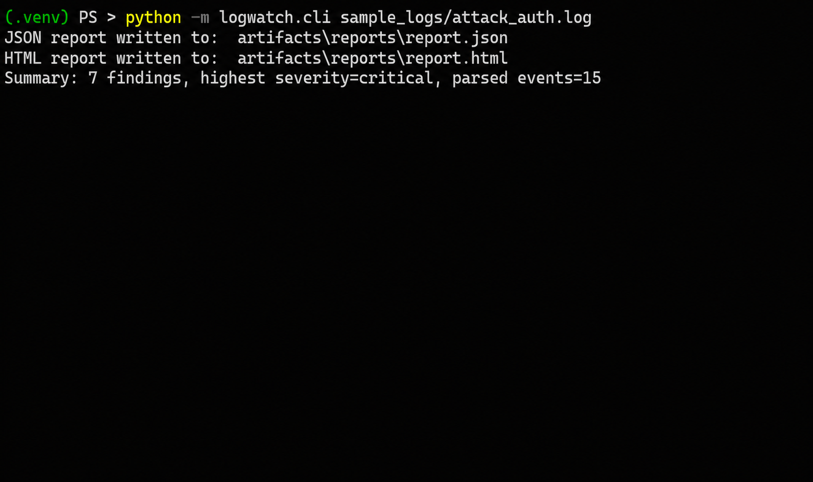
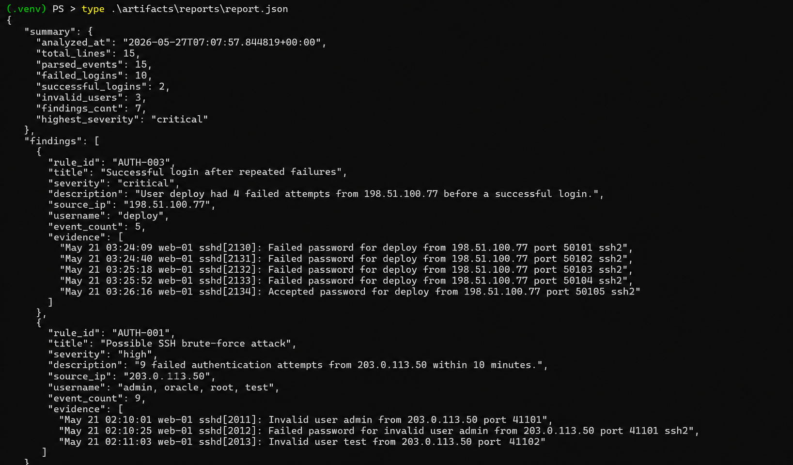
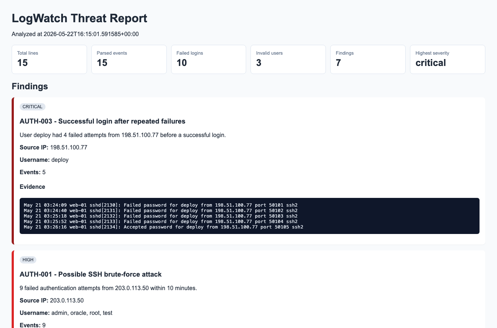
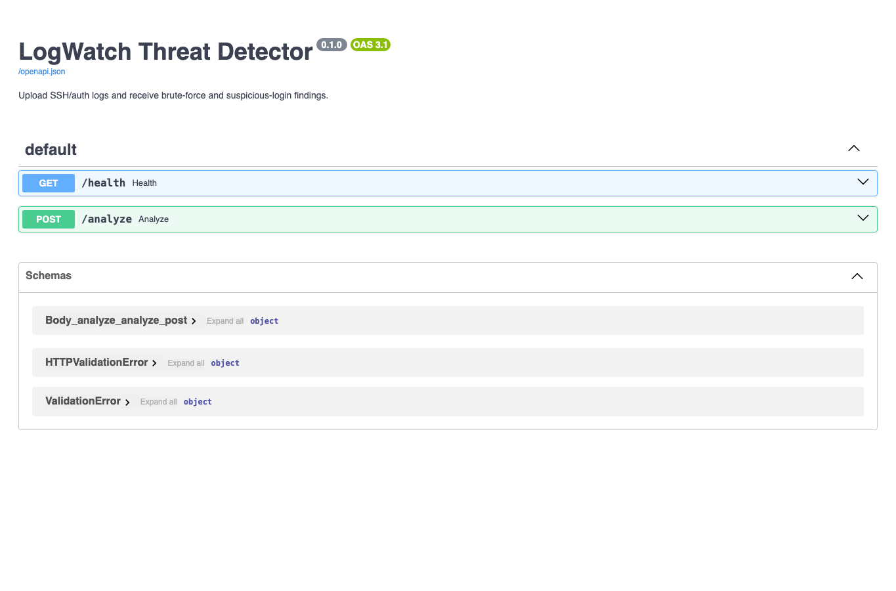

# LogWatch Threat Detector

A lightweight cybersecurity log-analysis pipeline for detecting suspicious SSH authentication activity in Linux systems.

It parses authentication logs, identifies attack patterns such as brute-force attempts and invalid-user spraying, generates structured security findings, and exposes analysis through both CLI tools and a REST API built with FastAPI.

---

## Features

- SSH authentication log parsing
- Detection of brute-force login attempts
- Invalid-user enumeration detection
- High-value account targeting detection
- Successful login after repeated failures detection
- JSON and HTML security reports
- FastAPI REST API with Swagger/OpenAPI documentation
- Automated tests using `pytest`
- Structured security findings with severity levels

---

## Detection Capabilities

| Rule ID | Detection | Severity |
|---|---|---|
| `AUTH-001` | Multiple failed logins from a single source within a short time window | High |
| `AUTH-002` | Invalid-user enumeration attempts | Medium |
| `AUTH-003` | Successful login after repeated failures | Critical |
| `AUTH-004` | Targeting privileged usernames such as `root` or `admin` | Low |

---

## Tech Stack

- Python
- FastAPI
- Pytest
- JSON / HTML reporting
- Structured log parsing

---

## Quick Start

### Create Virtual Environment

```bash
python -m venv .venv
```

### Activate Environment

**Linux/macOS**

```bash
source .venv/bin/activate
```

**Windows PowerShell**

```powershell
.\.venv\Scripts\Activate.ps1
```

### Install Dependencies

```bash
pip install -e ".[dev]"
```

---

## Run CLI Analysis

```bash
python -m logwatch.cli sample_logs/attack_auth.log
```

Example output:

```text
Summary: 7 findings, highest severity=critical, parsed events=15
```

Generated reports:

```text
artifacts/reports/report.json
artifacts/reports/report.html
```

---

## Run API

Start the API server:

```bash
uvicorn logwatch.api.main:app --reload
```

Open Swagger UI:

```text
http://localhost:8000/docs
```

### Available Endpoints

| Method | Endpoint | Purpose |
|---|---|---|
| `GET` | `/health` | Health check |
| `POST` | `/analyze` | Upload and analyze SSH authentication logs |

---

## Example API Request

```bash
curl -F "file=@sample_logs/attack_auth.log;type=text/plain" \
http://localhost:8000/analyze
```

---

## Run Tests

```bash
pytest
```

---

## Screenshots

Real project execution and generated artifacts.

### CLI Analysis



### JSON Report



### HTML Report



### FastAPI Swagger UI



---

## Repository Structure

```text
src/logwatch/parsers/
    SSH authentication log parsing

src/logwatch/detection/
    detection rules and analysis engine

src/logwatch/reporting/
    JSON and HTML report generation

src/logwatch/api/
    FastAPI application

sample_logs/
    clean and malicious SSH authentication logs

tests/
    parser, detection, analyzer, and API tests

artifacts/
    generated reports and outputs
```

---

## Example Workflow

```bash
python -m logwatch.cli sample_logs/attack_auth.log

uvicorn logwatch.api.main:app --reload
```

---

## Security Use Cases

- SOC analyst training
- SSH brute-force detection
- Linux authentication monitoring
- Detection engineering practice
- Security log parsing exercises
- Basic SIEM-style event analysis

---

## Future Improvements

- GeoIP enrichment
- Threat intelligence integration
- Real-time streaming analysis
- Detection rule configuration
- Dashboard visualization
- Alert correlation engine
- Support for additional log formats

---
